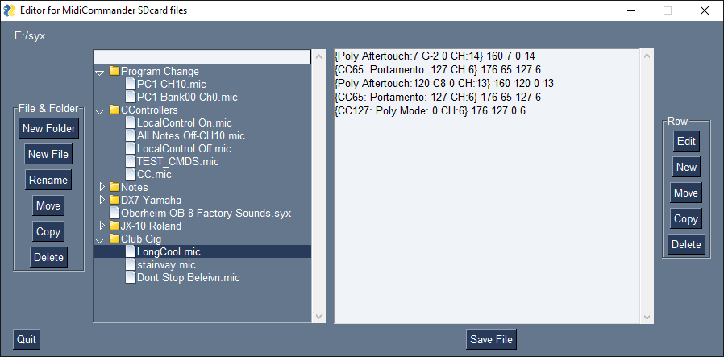

# MidiCommander
## A CircuitPython app for the Adafruit PyGamer with MIDI Featherwing

MidiCommander enables a user to "play" syx and .mic files stored in "playlists" on an SDcard, out to MIDI devices connected by MIDI cable to the MIDI Featherwing MIDI Out DIN connector.
It may be used to send MIDI data to several devices to configure a MIDI setup for each song during a gig.

The file: code.py contains the CircuitPython that runs on the PyGamer.

Press the B button for Help

More info is at http://chromakinetics.com/midicommander

## editmic
editmic is a Python GUI program that is an editing utility for use with MidiCommander.

editmic manages the files and playlist structure on the SDcard, and edits the contents of .mic files.

A .mic file simply contains one or more binary MIDI commands, typically Program Changes or CC, or any MIDI command.
The standard MIDI file (.mid) file is not used, as it is overly complex for this purpose, and no timing information is needed.

editmicm also manages .syx (files containing SYSEX data) but does not edit the contents of those.

A zip file containing a Windows executable version of editmic is also here.

